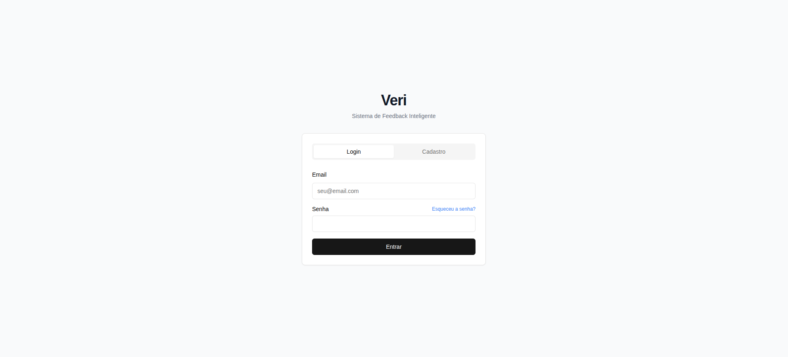

# Veri - Plataforma de Feedback e Pesquisa Interna


## 📌 Sobre o Projeto

 O Veri é um sistema web que permite a coleta e análise de feedbacks de funcionários e clientes, ajudando empresas a melhorar seus processos, cultura organizacional e satisfação do cliente.



## 🛠️ Tecnologias Utilizadas

- **Laravel** — Framework PHP para o back-end
- **PostgreSQL** — Banco de dados relacional
- **Laravel Sanctum** — Autenticação de API via token (Bearer Token)


## Documentação da API

### Autenticação

As rotas protegidas utilizam autenticação **Bearer Token**.  
Inclua o token no cabeçalho de requisição:

```http
Authorization: Bearer {token}
```


## Usuário

### Criar Usuário

```http
POST /api/register
```

| Parâmetro    | Tipo     | Descrição                       |
| :----------- | :------- | :------------------------------- |
| `name`       | `string` | **Obrigatório**. Nome do usuário |
| `email`      | `string` | **Obrigatório**. Email           |
| `password`   | `string` | **Obrigatório**. Senha           |

### Login de Usuário

```http
POST /api/login
```

| Parâmetro    | Tipo     | Descrição                       |
| :----------- | :------- | :------------------------------- |
| `email`      | `string` | **Obrigatório**. Email           |
| `password`   | `string` | **Obrigatório**. Senha           |

### Obter Usuário Logado

```http
GET /api/user
```

**Autenticado**.

### Logout

```http
POST /api/logout
```

**Autenticado**.

---

## Pesquisas

### Criar Pesquisa

```http
POST /api/pesquisas
```

| Parâmetro    | Tipo     | Descrição                                |
| :----------- | :------- | :--------------------------------------- |
| `nome`       | `string` | **Obrigatório**. Nome da pesquisa        |
| `descricao`  | `string` | **Obrigatório**. Descrição da pesquisa   |

### Buscar Todas as Pesquisas

```http
GET /api/pesquisas
```

**Autenticado**.

### Buscar Pesquisa por ID

```http
GET /api/pesquisas/{id}
```

| Parâmetro    | Tipo     | Descrição                        |
| :----------- | :------- | :-------------------------------- |
| `id`         | `integer` | **Obrigatório**. ID da pesquisa  |

### Atualizar Pesquisa

```http
PUT /api/pesquisas/{id}
```

| Parâmetro    | Tipo     | Descrição                                |
| :----------- | :------- | :--------------------------------------- |
| `nome`       | `string` | **Obrigatório**. Novo nome da pesquisa   |
| `descricao`  | `string` | **Obrigatório**. Nova descrição          |

### Deletar Pesquisa

```http
DELETE /api/pesquisas/{id}
```

| Parâmetro    | Tipo     | Descrição                       |
| :----------- | :------- | :------------------------------- |
| `id`         | `integer` | **Obrigatório**. ID da pesquisa  |


## Em construção 